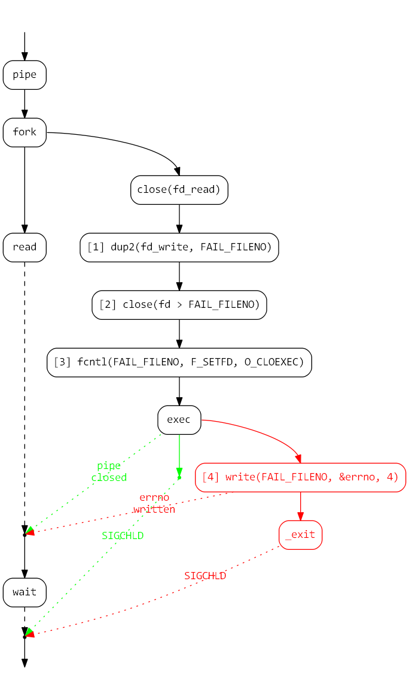

# Logging bug
## Introduction

In our product we place hooks on various system functions in order to modify existing application behaviour.

Regardless of the method of hooking, the basic concept is that suppose some system library implements function `F`, when that function is *hooked*, this means that if somewhere in the process some code calls `F`, it will end up reaching our own implementation of it which we will call `HOOK_F`. This implementation can wrap the original `F` with some code or might reimplement it completely.

This system allows us to implement specialized behaviours in processes but that is beyond the scope of this article.

Another thing about our system (and I believe any other system out there) are logs. In order for us to be able to debug and verify the functionality of our product we have logs places all over the place detailing, for example, the value of the parameters in the entrance of functions and return values in their end.

However, logs are something to be seen by the developers only, and they do add a bit of an overhead to the product, both in size (MiBs) and in performance, so we want to be able to easily switch them off.

To that end we have two build modes:
- Debug with all the logs
- Release where all the logs are shut out by the preprocessor, so they don't even get compiled

## The bug

While running some tests on new applications, there was one application that would crash on some Galaxy device with Android 4.4. The crash would however only occur in debug, **not** release.

The dev team member tasked with the issue managed to figure out the logs were probably at fault, and decided to discover which log specifically was at fault by using bisection. Basically binary search for the offending log but shutting down the logs in each module at a time, until the faulty module/s is/are found, and then shutting down specific logs inside the modules until the individual faulty logs are found.

The result was that the logs in the hooks for `dup2`, `close` and `execvpe` were the culprits. But the reason for them being faulty was not (yet) understood.

Anyway, due to the fact the crash was only in debug, the issue was deemed not interesting and was pushed to the bottom of the priority list.

Fast forward several weeks. I'm working on the finishing touches of a new hooking mechanism (again, as I mentioned in the introduction, the method itself is not important here). While running sanity tests on Android 7, one of the applications tested would crash.

As we tend to have many issues with debug-release discrepancies, the first thing I did was retry in release. The application worked. This smelled oddly familiar.

## Investigation

Examining the crash log revealed the cause of the crash was a Java exception which read as follows (redacted for readability):

    java.io.IOException: Cannot run program "chmod": error=456436480, Unknown error 456436480
        at java.lang.ProcessBuilder.start (ProcessBuilder.java:983)
        ...
    Caused by: java.io.IOException: error=456436480, Unknown error 456436480
        at java.lang.UNIXProcess.forkAndExec (Native Method)
        ...

However nice it is to have the location of the error pointed out to you, it's not too useful as I did not know what to look for, I needed some more focus.

The stack-trace does tell us that the problem was that it could not run the command `chmod`. Seeing that the name of the classes are `ProcessBuilder` and `UNIXProcess`, and the function is `forkAndExec`, I assumed it did not mean the `chmod` system call, but the command-line utility `/system/bin/chmod`.

It seemed odd that this utility will be missing, more so odd that it did not seem to pose a problem in release. But I tried anyway, I launched a shell on the device and tried to run `chmod`. It worked, of course.

I figured that if any of the `exec*` family system calls was called, I should be able to see it in the logs, as we have hooks on them and logs before calling the original `exec`. Sort of like this:

    int HOOK_execve(const char * filename, char * const argv[], char * const envp[])
    {
        LOG("execve(%s, ...)", filename);
        return execve(filename, argv, envp);
    }

However, there was no trace in the logs for that ever happening, so I figured it must not have gotten that far. Then what I want to know now is what happened to prevent `exec` from being called.
If you'll recall, in POSIX systems, the way to launch a new process is to first `fork`, then `exec` in the child and `wait` in the parent for a `SIGCHLD`:

So I put a hook on `fork` with a log before and after the original `fork`:

    pid_t HOOK_fork(void)
    {
        pid_t pid = -1;
        LOG("Before fork(). pid=%d", getpid());
        pid = fork();
        LOG("After fork(). pid=%d, ret=%d", getpid(), pid);
        return pid;
    }

And the same on `wait4` (all `wait` variants eventually use `wait4`). And just as expected, I saw 3 log lines for `fork` (one before the fork, and two after it - child and parent), and a log line for `wait4`. So the conclusion was that `fork` did happen, but it did not reach `exec`.

But then I remembered that a teammate of mine, who by that time had accumulated some mileage with Android 7, told me that he noticed the logging daemon tends to drop some log lines, maybe as a sort of throttling mechanism. His solution at the time was to modify the `LOG` function to write into a file on the SDCard, which he would pull from the device later on an examine off-line. I found this method slightly cumbersome, so instead what I did was launch a listening netcat on my machine (`nc -l 1337`), and have the `LOG` function write to a socket connected to my machine:
    
    void LOG(const char * fmt, ...)
    {
        va_list ap;
        va_start(ap, fmt);
        __android_log_vprint(ANDROID_LOG_INFO, "DEBUG", fmt, ap);
        log_to_socket(fmt, ap); /* ADDED THIS */
        va_end(ap);
    }

Now I should be able to see all the logs, not exceptions. I launch the app, examine the logs, but see the same thing: I see `fork`, I see `wait4`, but no `exec`.

However, this time around, though the contents of the log did not change, I did, or more precisely, my perception got keener. First, you must understand that we do not have hooks on just the 3 functions I mentioned, we have hooks on many other functions, as required by the special behaviour we want to add to the application. So what I noticed, was that the last log line in the child process was a `close`. In fact, there was a whole bunch of them in succession.

So I thought, that if my socket is in that list of `close`s, it would make sense that I stop seeing any log traffic. This is easy to verify, just log the `fd` of the logging socket after creating it and see if that `fd` is closed. And lo and behold, the socket's `fd` was in fact the last one closed in the child.

This is very odd though, why would something in the process close my socket? In any case, this is an easy fix, since I know the `fd` of the socket, and I control the behaviour of `close`, I can set it up so that if someone tries to close my socket, I'll just not do it, and report that I did:

    /* logging.c */
    int log_socket = -1;
    void log_init(void)
    {
        ...
        log_socket = socket(AF_INET, SOCK_STREAM, 0);
        ...
    }
    
    /* hooks.c */
    extern int log_socket;
    int HOOK_close(int fd)
    {
        if (fd == log_socket) return 0; /* These are not the droids you're looking for */
        return close(fd);
    }

With the new band-aid in place I was excited to finally be able to see those `exec` logs. And I did! `exec` was in-fact called. Just to verify it was actually called I placed a log before **and** after the call to the real `exec` and I just saw the first one, which means the `exec` did succeed. But then, why does the Java framework think it failed?

In my puzzled state I started just adding logs everywhere to try and make sense of what's going on there, and while doing that I decided that since my new logging channel is doing so well, I can do away with the `adb` log, so I commented out the `__android_log_vprint` from the `LOG` implementation.

The application worked.

To me this was a dead giveaway that something the logging library does is the source of the problem, but I had no concrete direction. What I did have though was a name, the name from the Java stack-trace. So I decided it's about time I find that source code and try to make some sense of it.

Using [androidxref](http://androidxref.com/) I quickly found the implementation of `forkAndExec` in [`/libcore/ojluni/src/main/native/UNIXProcess_md.c`](http://androidxref.com/7.0.0_r1/xref/libcore/ojluni/src/main/native/UNIXProcess_md.c#833). The code is pretty well written and documented, so it was not hard to understand how it works.

The main thing that the implementation addresses is that the parent process has no way of knowing whether the exec succeeded or not. So what they do it create a pipe before the call to `fork`, then in the child send the write end of the pipe to `O_CLOEXEC` (close-on-exec, meaning, the kernel should close this `fd` when performing `exec`), call `exec`, and after the `exec` (which should only happen in case of failure) write the `errno` into the pipe. Meanwhile, the parent reads from the pipe. If the `exec` succeeded, the pipe should close and 0 bytes should be read, if the `exec` failed, there should be 4 bytes waiting in the pipe indicating the reason for the failure.

So, we already know what happened from the start, the stack-trace told us, the `exec` failed with `errno = 456436480 (=0x1b34ab00)`. This is unlike any `errno` I know of. A Google search and an androidxref search confirmed it. Something here is clearly broken.

Something else is clearly writing into that pipe, so maybe if I had the contents of the pipe it could point me at who is writing there, and WHY!

In order to catch the appropriate `read` I had to get creative. The problem was that I don't know which `fd` belongs to the read end of the pipe. I could put a hook on `pipe` and then save the `fd` to some global variable and use that to determine the correct `read`. But what if there are several `pipe`s? And besides, this was too much work and code to write and I really did not feel like it. What made this `read` unique was that it read 4 bytes, so I could use that as an indicator.

Another problem is _how_ to read from the pipe. If I read too large a chunk then the read will block and I won't get to know what's in there. I could use `poll` and the like, but again, too much work, so I went for the simple solution of reading 1 byte at a time.

So I ended up with this monstrosity:

    ssize_t HOOK_read(int fd, void * buffer, size_t len)
    {
        if (4 == len) return read(fd, buffer, len);
        while (true)
        {
            char c = '\0';
            (void) read(fd, &c, sizeof(c));
            if (isalnum(c))
                LOG("%02x %c", c, c);
            else
                LOG("%02x", c);
        }
    }

_About the `while (true)`, I did not care if there program would hand, it would have crashed anyway, I just wanted to know what's in that pipe._

Time to look at what's in that pipe, and ... it's the log itself!

Just a quick reminder, I had two log channels, one on my machine to catch all the logs, and the one using `__android_log_vprint` to actually trigger the crash. So what I saw in the pipe must have been the log sent via `liblog`.

So I went back to the code of `forkAndExec` to really understand what's going on, no detail looked over. I'll summarize the flow of `forkAndExec` in this diagram:

Just to highlight the key points in the child:

1. The write end of the pipe is `dup2`ed to a constant `fd=3` (referred to `FAIL_FILENO`)
2. All the `fd`s higher than 3 are `close`d
3. `fd=3` is set to `O_CLOEXEC`
4. In case of `exec` failure, write the `errno` into `FAIL_FILENO`

This is where it finally clicked for me. Before I spell it out I'll give you one last hint:

You see, the logging facility on Android works by writing/sending a message to a device driver. On older Android versions it's `/dev/log/main` while on newer it's `/dev/socket/logdw`. The important thing though is that it boils down to a `writev` into an `fd`.

Now, it makes sense that the logging library would be one of the first libraries loaded and have its initializer called. This means that when that socket is about to be created, there are only 3 occupied `fd`s: `0=STDIN_FILENO`, `1=STDOUT_FILENO`, `2=STDERR_FILENO`, so the socket will be assigned the next available `fd`: 3.

Back to `forkAndExec`, when the child process `dup2`s the write end of the socket, nobody notifies the log library that its socket no longer exists, so when _someone_ (I) invokes `__android_log_vprint`, it happily writes into the `fd` it cached, which so happens to be 3, but now it's not a socket, it's a pipe.

Seeing as we had logs in the hooks on all the function called within the child meant that we shoved garbage in the pipe, making it seem to the parent like the child's `exec` failed when it did not.

## Summary

OK, so what did we have. We had a bug that would only happen in debug mode, where the reason for the bug was the presence of Android system logs.

`forkAndExec` made me face two issues. The first was not related to the bug itself, but it did veil the evidence to it. Namely, the fact that all the file descriptors were forcefully closed which made me lose the alternative log channel. This was fixed by lying to the system about closing that specific socket.

Once that obstacle was removed, 3 elements were required to reach the conclusion:

1. The contents of the pipe that was used to transfer the status of `exec` were needed to tie Android's logging to the bug.
2. Understanding how `liblog.so` works was in combination with a (justified) hypotheses about when it loads was required to understand that the logs are send via `fd=3`.
3. Understanding the flow of `forkAndExec`, mainly the flow of the child process, was required to understand that there is a clash between the original and new role of `fd=3`.

Once all the elements were understood, it was easy to connect the dots and find out what caused the bug: the presence of logs in the hooks on `close`, `dup2` and `execvpe`. Exactly what the original investigation led by the dev team member found.

## Conclusions

###Communication with your peers

It's important to have active and open conversations with peers about what it is you do.
Had I not talked to the dev team member, and not known about his issue, I would have never made the connection between the two problems.
And had my team member not told me about his problems with the weird behaviour of the logs on Android 7, I would not have been prompted to try and implement my own logging channel, which was instrumental to making progress.

###Know your platform

I don't believe this need any further explanation. Knowledge with the Linux system calls and with Android's logging mechanism were clearly required in this case. Learn about your platform and tools constantly.

The fact I was familiar with Android's logging mechanism was only due to the fact that at some point in time I decided to randomly read it's code. Which leads me to the next point.

###Read the code (RTFC?)

If you already have source code available, you might as well read it, and read it carefully. Maybe if I had read it more carefully from the get-go, I would have discovered the problem sooner.

###It's nearly always **your** fault

It's always easier to blame something else: "It's the system's fault". This can make you look for the problem in the wrong places and waste precious time.
