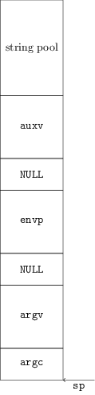

# Where is my `auxv` or How many `NULL`s?

Recently I had to find a cross-platform method to read values from the auxiliary vector. More specifically 

So first I just used `getauxval` which is a simple API. However, this only exists from API level 17 (Android 4.3).

A quick consultation with Android's usage statistics revealed that about 13% of all Android devices use API level 16 or lower. So I had no choice, must find a way to support that too.

So next I went to try and read `/proc/self/auxv`. Which worked fine, until testing in release.

Part of building the application in release involves setting `android:debuggable` to `false` in `AndroidManifest.xml`. As it turns out, when `android:debuggable` is set to `false`, the Zygote, before running `setuid`, makes `/proc/self/auxv` readable only by `root`:

    $adb shell ls -l /proc/<pid>
    -r-------- root     root            0 2016-11-03 18:37 auxv
    ...

Back to the drawing table.
 
From androidxref, the lookup code in the linker (Android 4.2.2) says:

    static unsigned find_linker_base(unsigned **elfdata) {
        int argc = (int) *elfdata;
        char **argv = (char**) (elfdata + 1);
        unsigned *vecs = (unsigned*) (argv + argc + 1);
        while (vecs[0] != 0) {
            vecs++;
        }

        /* The end of the environment block is marked by two NULL pointers */
        vecs++;
    ...

This function is called first in `__linker_init` and `elfdata` is just `sp` that was passed to it as a parameter.

So what I deduce from this code, is that the structure of the stack when the kernel returns from `execve` is this:

At the very top we have a string pool. Basically all the argument and environment strings all bunched up. Below that there's the auxiliary vector `auxv`. Below that is a list of pointers to environment variables, separated from the `auxv` block with a `NULL` word. Then comes a list of pointers to the program arguments, again, separeted from the previous block with a `NULL` word, and finally the number of program arguemnts `argc`.

There's just one thing that struck me as odd, it was the following comment:

    /* The end of the environment block is marked by two NULL pointers */

According to what I understand from the code, only one `NULL` word is skipped following the `envp` block.

I attributed this to maybe an inexperienced programmer (working on the linker? hard to imagine), but I did not dwell on it.

Anyway, this structure meant I can get to `auxv` myself if I just start from `envp` (which is accessible by `extern char ** environ` which libc exports) and follow the same procedure. Very simple.

Commit. Push. Wait for the test results.

All the devices were fine, except for Galaxy S4 Mini with Android 4.4.2, where all the calls to my `getauxval` returned 0.

I debug the app and examine the memory after the end of `envp`. I see **TWO** `NULL`s.

How odd, the comment in the code said that there were two `NULL`s.

Anyway, I fix the code to just skip as many `NULL`s as needed, and everything works fine. But this still bothers me, why is this device different?

So I start formulating a hypothesis. Maybe when the Samsung developers were coding their version of the OS, they look at the original code, but just at the comment, and interpreted it the wrong way, so in their kernel the actually **are** two `NULL` words between the end of the environment variables and the auxiliary vector.

Only one way to find out - check the code. However without access to Samsung's source code, I had to resort to some reverse-engineering.

Disassembly of Galaxy Mini's linker:

    00000a60 <_start>:
         a60:   e1a0000d    mov r0, sp
         a64:   e3a01000    mov r1, #0
         a68:   fa00085c    blx 2be0
         a6c:   e1a0f000    mov pc, r0
    ...
            ; r0: void ** ptr
        2be0:   e92d 4ff0   stmdb   sp!, {r4, r5, r6, r7, r8, r9, sl, fp, lr}
        2be4:   b0d3        sub sp, #332    ; 0x14c
            ; r3 = *(int *)ptr = argc
            ; ptr++
        2be6:   f850 3b04   ldr.w   r3, [r0], #4
        2bea:   1c59        adds    r1, r3, #1
            ; argv = (char **)ptr
        2bec:   9005        str r0, [sp, #20]
            ; argc = r3
        2bee:   9304        str r3, [sp, #16]
            ; ptr += argc + 1
        2bf0:   eb00 0081   add.w   r0, r0, r1, lsl #2
            ; envp = (char **)ptr
        2bf4:   9006        str r0, [sp, #24]

        2bf6:
        2bf6:   4602        mov r2, r0
        2bf8:   3004        adds    r0, #4
        2bfa:   6814        ldr r4, [r2, #0]
        2bfc:   2c00        cmp r4, #0
        2bfe:   d1fa        bne.n   2bf6
        2c00:   4605        mov r5, r0
        2c02:   9007        str r0, [sp, #28]
        2c04:   e004        b.n 2c10

        2c06:   2c07        cmp r4, #7
        2c08:   d101        bne.n   2c0e
        2c0a:   686c        ldr r4, [r5, #4]
        2c0c:   e003        b.n 2c16

        2c0e:   3508        adds    r5, #8

        2c10:   682c        ldr r4, [r5, #0]
        2c12:   2c00        cmp r4, #0
        2c14:   d1f7        bne.n   2c06

        2c16:   69e6        ldr r6, [r4, #28]

From the linker it seems pretty obvious that **only one** `NULL` is skipped.

This makes no sense. Where did the second `NULL` come from???

In the linker's code of Android 4.2.2 I ran into the following function:

    void
    linker_env_unset(const char* name)
    {
        char**  readp = _envp;
        char**  writep = readp;

        if (name == NULL || name[0] == '\0')
            return;

        for ( ; readp[0] != NULL; readp++ ) {
            if (env_match(readp[0], name))
                continue;
            writep[0] = readp[0];
            writep++;
        }
        /* end list with a NULL */
        writep[0] = NULL;
    }

    /* Remove unsafe environment variables. This should be used when
     * running setuid programs. */
    void
    linker_env_secure(void)
    {
        /* The same list than GLibc at this point */
        static const char* const unsec_vars[] = {
            "GCONV_PATH", "GETCONF_DIR", "HOSTALIASES", "LD_AUDIT", "LD_DEBUG",
            "LD_DEBUG_OUTPUT", "LD_DYNAMIC_WEAK", "LD_LIBRARY_PATH", "LD_ORIGIN_PATH",
            "LD_PRELOAD", "LD_PROFILE", "LD_SHOW_AUXV", "LD_USE_LOAD_BIAS",
            "LOCALDOMAIN", "LOCPATH", "MALLOC_TRACE", "MALLOC_CHECK_", "NIS_PATH",
            "NLSPATH", "RESOLV_HOST_CONF", "RES_OPTIONS", "TMPDIR", "TZDIR",
            "LD_AOUT_LIBRARY_PATH", "LD_AOUT_PRELOAD", NULL
        };

        int count;
        for (count = 0; unsec_vars[count] != NULL; count++) {
            linker_env_unset(unsec_vars[count]);
        }
    }

Looks like this code is getting rid of unwanted environment variables by removing the entries and shrinking `evnp`.

Let's verify, I bash-fu'd and python-fu'd a set intersection between the environment variables on the Galaxy Mini (`adb shell set`) and the `unsec_vars`. Got one hit: `LD_LIBRARY_PATH`.

Check on some other device - no intersection.

Now it makes sense, when the linker first iterates over `envp` in order to get to `auxv` the `envp` list is still full. After a while though, it calls `linker_env_secure`, which shrinks the list, adding more `NULL`s between `envp` and `auxv`.

Could this be the reason that the comment said "skip the second NULL"? We'd love to your thoughts, or even better, if you have some factual insight to shed.
